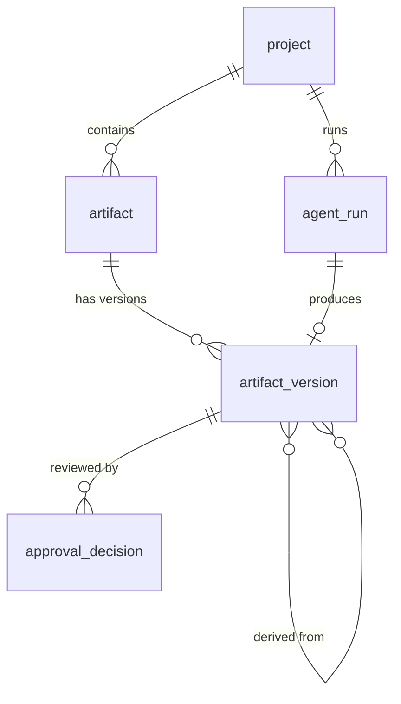

# V1 Data Model (proposed)

The persistence model for [ADR-0001](../architecture/decisions/0001-artifact-workflow-approval-model.md).
It targets PostgreSQL. The implementation is `packages/db/src/schema.ts`
(Drizzle, see [ADR-0002](../architecture/decisions/0002-postgres-and-drizzle.md));
the SQL below is the conceptual reference, and the generated migrations in
`packages/db/migrations/` are authoritative.

## Entities



## Schema

```sql
create table project (
  id          uuid primary key default gen_random_uuid(),
  name        text not null,
  idea        text not null,              -- the original product/feature idea
  created_at  timestamptz not null default now()
);

-- A logical document (e.g. "the requirements for this project").
create table artifact (
  id          uuid primary key default gen_random_uuid(),
  project_id  uuid not null references project(id) on delete cascade,
  type        text not null,              -- 'requirements' | 'design_spec' | 'task_list' | ...
  created_at  timestamptz not null default now(),
  unique (project_id, type)               -- V1: one artifact per type per project
);

-- Immutable snapshots. Revisions create new rows.
create table artifact_version (
  id              uuid primary key default gen_random_uuid(),
  artifact_id     uuid not null references artifact(id) on delete cascade,
  version         int  not null,
  status          text not null,          -- 'draft' | 'pending_approval' | 'approved' | 'rejected' | 'superseded'
  content         jsonb not null,         -- validated against the artifact type's schema
  schema_version  int  not null,          -- lets artifact-type schemas evolve
  produced_by_run uuid,                   -- FK to agent_run added below
  created_at      timestamptz not null default now(),
  unique (artifact_id, version)
);

-- Lineage: which upstream versions an artifact version was built from.
create table artifact_version_input (
  artifact_version_id  uuid not null references artifact_version(id) on delete cascade,
  input_version_id     uuid not null references artifact_version(id),
  primary key (artifact_version_id, input_version_id)
);

create table agent_run (
  id              uuid primary key default gen_random_uuid(),
  project_id      uuid not null references project(id) on delete cascade,
  role            text not null,          -- 'pm' | 'designer' | 'engineer'
  status          text not null,          -- 'queued' | 'running' | 'succeeded' | 'failed'
  input           jsonb not null,         -- input artifact version ids, feedback, etc.
  model           text,
  input_tokens    int,
  output_tokens   int,
  error           text,
  trace_id        text,
  idempotency_key text unique,            -- becomes important once runs move to a queue
  started_at      timestamptz,
  finished_at     timestamptz,
  created_at      timestamptz not null default now()
);

alter table artifact_version
  add constraint artifact_version_run_fk
  foreign key (produced_by_run) references agent_run(id);

create table approval_decision (
  id                  uuid primary key default gen_random_uuid(),
  artifact_version_id uuid not null references artifact_version(id) on delete cascade,
  decision            text not null,      -- 'approved' | 'rejected'
  feedback            text,               -- fed to the revision run on rejection
  decided_at          timestamptz not null default now()
);
```

## Rules

- **Current version:** the highest `version` for an artifact. The
  **effective** version for downstream work is the latest one with status
  `approved`.
- **Content validation:** `content` is validated with the artifact type's Zod
  schema from `@repo/artifacts` before insert, and `schema_version` records
  that schema's version.
- **Revision flow:** rejecting version _n_ creates an agent run whose input
  includes version _n_ and the feedback. That run produces version _n+1_, and
  version _n_ keeps status `rejected`.
- **Workflow gating:** a role becomes eligible to run when all of its required
  input artifact types have an approved version. For V1 the workflow
  definition lives in code, not the database.
- **No users table in V1.** It is single-user, so approvals carry no actor.
  Add `user` and `decided_by` when multi-user support arrives.

## Open questions

- Whether to store full prompts and completions in Postgres or only in the
  tracing backend.
